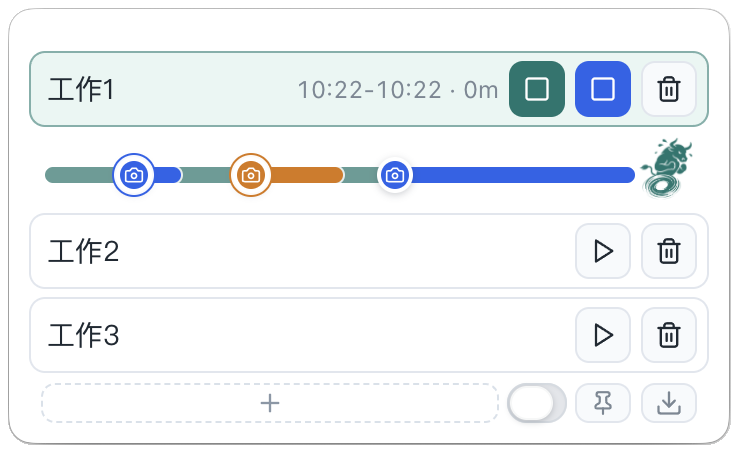

# 忙个明白

一个给办公室个人使用的轻量桌面工作记录工具。

它解决的问题很简单：忙了一天，却说不清自己到底忙了什么。你可以用它记录主线工作、被打断的现场、每次打断占用的时间，并在一天结束后导出一张 24 小时时间轴。

> English: Busy Clear is a lightweight desktop work recorder for capturing tasks, interruptions, screenshots, and a daily timeline.

## 适合谁

- 经常被临时消息、会议、核对、返工打断的人。
- 需要写日报、复盘时间、向领导说明工作内容的人。
- 不想使用复杂团队系统，只想在本机低摩擦记录的人。

## 主要功能

- 主任务计时：开始、结束、继续后累积工作时长。
- 单任务防呆：同一时间只允许一个主任务运行，避免重复统计。
- 截图子项：被打断时截图，自动创建子项并开始计时。
- 子项后续：同一件打断后续又来了，可以右键追加到同一个颜色。
- 拖拽删除：把时间条上的截图点拖到垃圾桶，删除子项或某次后续。
- 快捷键：支持主任务开始/停止、截图/结束子项快捷键。
- 菜单栏入口：可切换无感模式、置顶、打开说明书、快速切换前三个主任务。
- 主任务排序：拖动主任务栏空白区域或时间段调整顺序。
- 时间轴导出：导出过去 24 小时 PNG，展示主线、打断、截图文件名和总结。

## 演示

演示视频：[busy-clear-github-preview.mp4](docs/assets/busy-clear-github-preview.mp4)

更高清的最终演示视频建议放在 GitHub Release 中。





## 安装体验

当前第一版优先支持 macOS Apple Silicon。

下载 `.dmg` 后安装到“应用程序”即可。当前安装包尚未做 Apple Developer ID 签名，首次打开时 macOS 可能会提示安全确认，需要在系统设置中允许打开。

## 使用方式

普通使用者请看：[用户使用说明.md](用户使用说明.md)。

最短流程：

1. 点击 `+` 添加主任务。
2. 点击开始按钮，记录当前工作。
3. 被打断时点击相机，截图并创建子项。
4. 子项处理完后点击结束按钮。
5. 一天结束后导出 24 小时时间轴 PNG。

## 文件和隐私

忙个明白是本地桌面工具，不需要账号，也不会主动上传工作记录或截图。

工作记录保存在 Electron 的 `userData` 目录下。macOS 通常位于：

```text
~/Library/Application Support/忙个明白/work-data/
```

截图和导出的时间轴默认保存在：

```text
~/Pictures/忙个明白/截图/YYYY-MM-DD/
```

更详细的隐私说明请看：[PRIVACY.md](PRIVACY.md)。

## 开发

技术栈：

- Electron
- React + TypeScript
- Vite / electron-vite
- Vitest

安装依赖：

```bash
npm install
```

启动开发版：

```bash
npm run dev
```

运行测试：

```bash
npm test
```

类型检查：

```bash
npm run typecheck
```

构建：

```bash
npm run build
```

打包 Mac：

```bash
npm run dist:mac
```

打包 Windows：

```bash
npm run dist:win
```

## 项目结构

```text
src/main/       Electron 主进程：窗口、托盘、截图、本地文件、导出
src/preload/    渲染进程安全桥接
src/renderer/   React 界面
src/shared/     可测试的业务逻辑、类型、报告生成
build/          应用图标资源
release/        打包产物，不纳入 Git
```

## 路线图

- 完善 macOS 第一版体验。
- 适配 Windows 截图、托盘、窗口行为和打包流程。
- 优化时间轴导出样式。
- 根据真实使用反馈补充更多复盘能力。

## 许可证

本项目使用 MIT License。详见 [LICENSE](LICENSE)。

## 第三方素材

宣传视频中的音乐、音效或其他素材来源请看：[ATTRIBUTIONS.md](ATTRIBUTIONS.md)。
